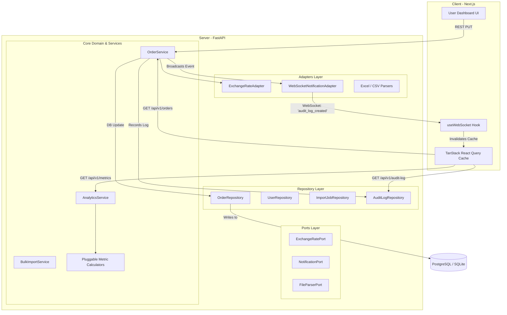

# Real-Time Order Management & Analytics Dashboard

[](https://github.com/Ephraim123abrham123/orderapp/actions/workflows/ci.yml)
*Test Coverage: 71% Backend Coverage | 100% Frontend Hooks Coverage*

A premium, full-stack real-time order tracking and customizable analytics portal built for managers, operations teams, and warehouse staff. It processes sales orders across multiple currencies with live API-driven exchange rates, supports bulk Excel/CSV file imports executed in asynchronous background task queues, and automatically synchronizes all concurrent browser sessions through event-driven WebSocket broadcasts.

---

## 🎥 Walkthrough Demo

<!-- DEMO GIF PLACEHOLDER -->
> [!NOTE]
> **Instructions to capture the demo GIF**:
> 1. Log in to the application at `http://localhost:3000` using the credentials `admin` / `admin`.
> 2. Open the main Dashboard and arrange your layout widgets as desired.
> 3. Go to the Orders tab, open the status dropdown menu on any order, and change the status (e.g. `Pending` ➜ `Completed`).
> 4. Go back to the dashboard page to witness the sales charts updating and the **Live Audit Log** panel populating the status transition instantly via WebSockets without page reload.
> 5. Upload the test spreadsheet file `mock_orders_new.xlsx` in the Import section and see the progress indicators progress in real-time.

---

## 🛠️ Technology Stack

| Layer | Technology | Primary Role |
| :--- | :--- | :--- |
| **Backend Core** | FastAPI (Python) | High-performance async ASGI API framework and WebSocket routing gateway. |
| **Database ORM** | SQLAlchemy + asyncpg | Asynchronous PostgreSQL connection driver and query builder. |
| **Database Migrations** | Alembic | Track schema revisions and run production schema upgrades. |
| **Frontend Framework** | Next.js (TypeScript) | App Router page layouts, route guards, and component rendering. |
| **State Caching** | TanStack React Query (v5) | Server-state caching, optimistic updates, and reactive cache invalidation. |
| **Global UI State** | Zustand | Manages sidebar layout states and active toast notifications. |
| **Data Visualizations** | Recharts | Canvas rendering of daily revenue trend lines and status breakdowns. |
| **Custom Grid Layout** | React Grid Layout | Enables drag-and-drop dashboard dashboard resizing and layouts persistence. |

---

## 📐 Architecture & Event Synchronization Flow

The project is structured under **Hexagonal (Ports & Adapters) Architecture** to ensure core domain logic is decoupled from frameworks, database drivers, and external converters.



---

## 🧠 Why Hexagonal Architecture?

By separating business logic inside core **Services** and interacting with data pipelines through abstract interfaces called **Ports**, the domain is entirely insulated from infrastructure dependencies. This ensures we can swap external services—such as migrating from local CSV parsing to cloud-based APIs, or changing the database engine—without touching the business rules. It also allows us to write fast, isolated unit tests by mocking interface adapters in milliseconds without opening live network connections or database sockets.

---

## 🚀 Setup & Installation

The easiest way to boot the complete database, backend, and frontend ecosystem is using Docker.

### 1. Launch via Docker Compose (Recommended)
From the project root directory, run:
```bash
docker-compose up --build
```
This command automatically:
* Starts a **PostgreSQL 15** container.
* Creates database tables and runs Alembic migrations.
* **Auto-Seeds** the database with a default admin user (`admin` / `admin`) and sample orders.
* Starts the **FastAPI Backend** on `http://localhost:8000`.
* Starts the **Next.js Frontend** on `http://localhost:3000`.

### 2. Run Tests Locally

**Backend (Python + Pytest)**
```bash
cd backend
PYTHONPATH=. .venv/bin/pytest --cov=app tests/
```

**Frontend (Next.js + Vitest)**
```bash
cd frontend
npm run test
```

---

## 🔮 Future Improvements

*   **Sentry Error Tracking**: Captures and alerts on runtime backend exceptions and frontend crash states.
*   **Prometheus Metrics**: Exposes endpoints tracking system load, query latency, and WebSocket socket counts.
*   **Celery & Redis Task Queue**: Offloads spreadsheet processing background tasks to scaling dedicated workers.
*   **Role-Based Access Control (RBAC)**: Restricts status changes and bulk imports to designated administrators.
*   **Refresh Token Rotation**: Enhances JWT auth flow security by preventing replay attacks through rolling session tokens.
