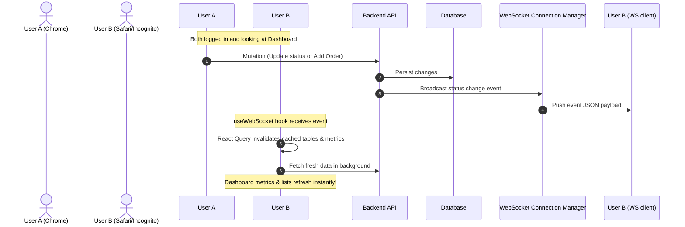

# Testing Playbook: Real-Time Order Management Dashboard

This playbook details the step-by-step instructions and testing scripts to verify every single feature of the **Order Management Dashboard**.

---

## 1. Automated Backend API & Lifecycle Verification (cURL Sequence)

Run this sequence in your terminal to verify API authentication guards, Pydantic input validation, status updates, and dynamic currency conversions.

### Step 1: Attempt Unauthenticated Request (Expect `401 Unauthorized`)
Verify that endpoint guarding is functional:
```bash
curl -i -X GET http://localhost:8000/api/v1/orders
```
* **Expected Response**: Status code `401 Unauthorized` with JSON body:
  ```json
  {"detail": "Not authenticated"}
  ```

---

### Step 2: Authenticate and Retrieve JWT Token (Expect `200 OK`)
Log in using the seeded credentials (`admin` / `admin`):
```bash
TOKEN=$(curl -s -X POST http://localhost:8000/api/v1/auth/login-json \
  -H "Content-Type: application/json" \
  -d '{"username": "admin", "password": "admin"}' | grep -o '"access_token":"[^"]*' | grep -o '[^"]*$')

echo "Acquired Token: $TOKEN"
```
* **Expected Response**: Returns a valid JWT `access_token` and `token_type: bearer`.

---

### Step 3: Attempt Order Creation with Bad Data (Expect `422 Unprocessable Entity`)
Submit an order with an invalid amount (must be greater than 0):
```bash
curl -i -X POST http://localhost:8000/api/v1/orders \
  -H "Authorization: Bearer $TOKEN" \
  -H "Content-Type: application/json" \
  -d '{"customer_name": "Test Client", "amount": -10.50, "currency": "USD"}'
```
* **Expected Response**: Status code `422 Unprocessable Entity`. The JSON body lists the Pydantic validator failure:
  ```json
  {
    "detail": [
      {
        "type": "greater_than",
        "loc": ["body", "amount"],
        "msg": "Input should be greater than 0",
        "input": -10.5
      }
    ]
  }
  ```

---

### Step 4: Create Order with Valid Foreign Currency (Expect `201 Created` with Conversion)
Submit an order in British Pounds (GBP). The backend should call the exchange rate adapter and populate the `usd_amount` field:
```bash
curl -s -X POST http://localhost:8000/api/v1/orders \
  -H "Authorization: Bearer $TOKEN" \
  -H "Content-Type: application/json" \
  -d '{"customer_name": "QA tester", "amount": 100.00, "currency": "GBP"}' | json_pp
```
* **Expected Response**: Status code `201 Created`. The payload includes `id`, converted `usd_amount` (e.g., `~128.00` based on the currency rate), and default status `"Pending"`.

---

### Step 5: Filter & Paginate Orders (Expect `200 OK`)
Search for our tester order and filter by `"Pending"` status:
```bash
curl -s -X GET "http://localhost:8000/api/v1/orders?search=QA&status=Pending&page=1&size=10" \
  -H "Authorization: Bearer $TOKEN" | json_pp
```
* **Expected Response**: Total counter equals `1` and the results array contains only the order created in Step 4.

---

### Step 6: Transition Order Status (Expect `200 OK` & WebSocket Broadcast)
Transition the order from `"Pending"` to `"Processing"`:
```bash
# Replace '21' with the ID returned in Step 4
curl -s -X PUT http://localhost:8000/api/v1/orders/21/status \
  -H "Authorization: Bearer $TOKEN" \
  -H "Content-Type: application/json" \
  -d '{"status": "Processing"}' | json_pp
```
* **Expected Response**: Returns the updated order with `"status": "Processing"` and a refreshed `updated_at` timestamp.

---

## 2. Manual Frontend E2E Walkthrough

Follow these instructions to verify visual feedback, protected route guards, and widget interactions.

### Step 1: Protected Route Guarding
1. Open your browser and navigate directly to [http://localhost:3000/dashboard](http://localhost:3000/dashboard) or [http://localhost:3000/orders](http://localhost:3000/orders).
2. **Verify**: The UI immediately triggers a redirect and sends you back to `/login` since you do not have an active session token.

### Step 2: Sign In Page
1. On the login screen, attempt to sign in with incorrect details (e.g. `admin` / `wrongpwd`).
2. **Verify**: An error toast pops up displaying the formatted error: `"Incorrect username or password"`.
3. Clear the fields, enter **`admin`** and **`admin`**, then click **Sign In**.
4. **Verify**: You are redirected to the Dashboard Overview. The topbar connection indicator displays a green **"Live Connected"** badge.

### Step 3: Analytics Grid (Drag & Drop)
1. Navigate to **Custom Analytics** in the sidebar.
2. Drag and rearrange the cards (e.g., move the "Total Orders" KPI card to the right side).
3. Resize the "Daily Revenue Trend" line chart.
4. **Verify**: When you stop dragging or resizing, a small spinner appears next to the toolbar indicating `"Saving layout..."`. 
5. Refresh the page.
6. **Verify**: The grid retains your custom sizing and coordinates.

### Step 4: Status Updates
1. Navigate to **Orders List** in the sidebar.
2. Locate any order in the table. Click the edit pencil icon in the status column.
3. Select a new status from the dropdown (e.g., transition from `Pending` to `Completed`).
4. **Verify**: The row displays a loading spinner, then instantly changes color to a solid green Completed badge, and a success toast notifications pops up.

---

## 3. The "Two-Browser" WebSocket Test

This scenario confirms that operations performed by one user immediately synchronize the UI of another user without manual refreshes.



### Steps to Execute:
1. Open **Browser A** (e.g. Chrome) and log in. Navigate to **Dashboard Overview**.
2. Open **Browser B** (e.g. Safari, Firefox, or Chrome Incognito) and log in. Navigate to **Dashboard Overview**.
3. Arrange the browser windows side-by-side on your screen so you can see both simultaneously.
4. In **Browser A**, click **Orders List** and use the **"+ New Order"** form to submit a new transaction:
   * Customer: `"WS Synchronizer"`
   * Amount: `450.00`
   * Currency: `USD`
5. Click **Submit** on Browser A.
6. **Verify (Simultaneous Reactivity)**:
   * On **Browser A**, the modal closes and a success toast pops up.
   * On **Browser B** (which remained untouched), the **Total Orders** KPI card increases by `1`, the **Total Revenue** KPI card increases by `$450.00`, and a slide-in alert appears saying: `"New order #22 created for WS Synchronizer"`.

---

## 4. Resilience & Infrastructure Checks

Ensure database migrations are aligned and third-party APIs have robust local fallbacks.

### 1. Alembic Migrations
Verify that the database schema is up-to-date and tracks local files accurately:
```bash
cd backend
source .venv/bin/activate
alembic current
```
* **Expected Output**: Displays the latest migration revision hash followed by `(head)` (e.g., `8d2f0980c5bd (head)`).

---

### 2. External API Currency Fallback Resilience Test
To verify that the application degrades gracefully when the external Exchange Rate API times out or is offline:

1. **Simulate Offline API**:
   Modify [config.py](file:///Users/jiji/Desktop/Order_app_new_architecture/backend/app/core/config.py#L20) and point `EXCHANGE_RATE_API_URL` to an unreachable local URL:
   ```python
   EXCHANGE_RATE_API_URL: str = "http://127.0.0.1:9999/invalid-api"
   ```
2. **Submit a conversion request**:
   Navigate to the frontend dashboard and add a new order in `EUR`.
3. **Verify backend resilience**:
   * The backend does **not** throw a 500 error or crash.
   * The backend logs display a warning:
     ```
     ExchangeRate-API offline or timed out. Falling back to hardcoded conversions.
     ```
   * The order is saved successfully using our hardcoded fallback conversion rates (e.g. `EUR -> USD = 1.09`).
4. **Restore Configuration**:
   Revert the `EXCHANGE_RATE_API_URL` in `config.py` to its original value:
   `https://open.er-api.com/v6/latest/USD`
